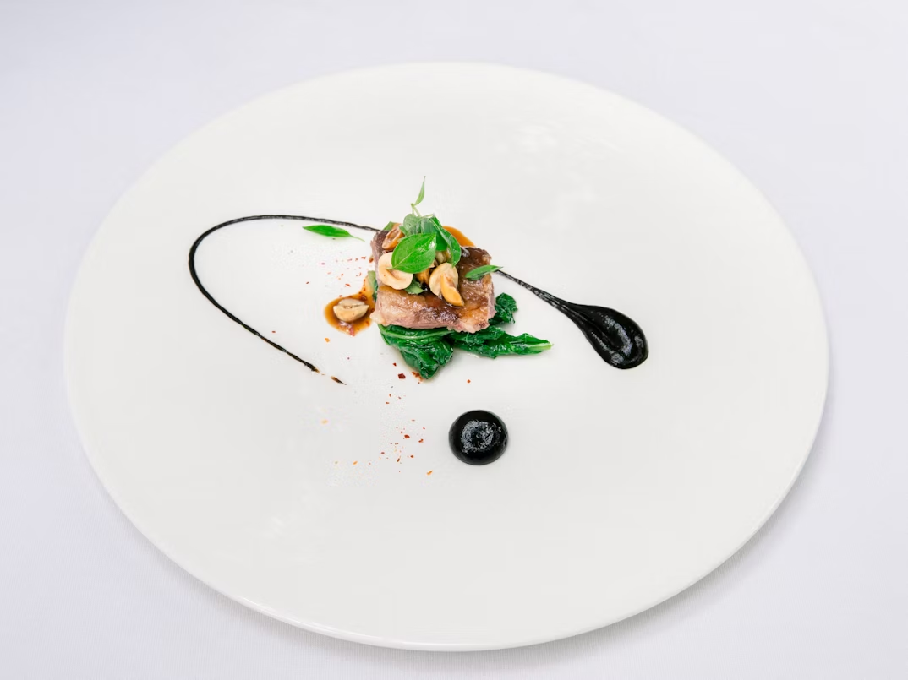

# The Line - Restaurant Website

A modern, responsive restaurant website for "The Line", a fine dining establishment in Chicago's River North neighborhood. Built with vanilla HTML, CSS, and JavaScript, featuring elegant design, smooth animations, and comprehensive responsive layouts. A tribute to the tv show "The Bear".



## Features

### Design & User Experience
- **Responsive Design**: Optimized for desktop, tablet, and mobile devices
- **Modern Layout**: Clean, professional design with elegant typography
- **Smooth Animations**: AOS (Animate On Scroll) library integration
- **Interactive Elements**: Custom slideshow, navigation menu, and hover effects
- **Accessibility**: Semantic HTML and keyboard navigation support

### Pages & Functionality
- **Home Page**: Hero section with company branding and call-to-action
- **Experience Page**: Detailed menu information with automatic image slideshow
- **Events Page**: Private dining information with manual slideshow controls
- **About Page**: Company story and team information
- **Contact Page**: Restaurant details and reservation information

### Technical Features
- **Flexbox Layout**: Modern CSS layout for all page structures
- **CSS Grid**: Advanced footer layout with responsive behavior
- **Custom Slideshow**: JavaScript-powered image carousels
- **Mobile-First Design**: Progressive enhancement approach
- **Cross-Browser Compatibility**: Tested across modern browsers

## Live Demo

[View Live Website](https://the-line-restaurant.onrender.com/)

## 📱 Responsive Breakpoints

- **Mobile**: 320px - 768px
- **Tablet**: 769px - 1024px  
- **Desktop**: 1025px+

## 🛠 Technologies Used

- **HTML5**: Semantic markup and structure
- **CSS3**: Modern styling with Flexbox and Grid
- **JavaScript (ES6)**: Interactive functionality
- **AOS Library**: Scroll animations
- **Font Awesome**: Icon system

## 📁 Project Structure

```
The Line/
├── images/                 # Restaurant images and assets
│   ├── hero-image.png
│   ├── bar.png
│   ├── event1.jpg
│   └── ...
├── style/                  # CSS stylesheets
│   ├── home-style.css
│   ├── experience-style.css
│   ├── events-style.css
│   ├── about-style.css
│   ├── contact-style.css
│   └── sidemenu-style.css
├── scripts/                # JavaScript files
│   ├── main.js
│   ├── experience.js
│   └── sidemenu.js
├── index.html              # Homepage
├── experience.html        # Menu and dining experience
├── events.html           # Private dining and events
├── about.html            # Company information
├── contact.html          # Contact and reservations
└── README.md
```

## 🔧 Installation & Setup

1. **Clone the repository**
   ```bash
   git clone https://github.com/OscarRapale/The-Bear-Mock-Website.git
   ```

2. **Open with Live Server**
   - Use VS Code Live Server extension
   - Or any local web server

3. **View in Browser**
   ```
   http://localhost:5500/index.html
   ```

## Key Features Breakdown

### Navigation System
- **Responsive Header**: Logo, address, and reservation button
- **Mobile Menu**: Slide-out navigation with smooth animations
- **Consistent Layout**: Same header structure across all pages

### Slideshow Functionality
- **Automatic Slideshow**: Experience page with 4-second intervals
- **Manual Controls**: Events page with previous/next arrows
- **Responsive Images**: Consistent sizing across all devices

### Responsive Design Implementation
- **Mobile-First Approach**: Base styles for mobile, enhanced for larger screens
- **Flexible Grid System**: Custom footer grid that adapts to screen size
- **Typography Scaling**: `clamp()` function for responsive text sizing

## Design Highlights

### Color Palette
- **Primary Background**: `#fff9ef` (Warm cream)
- **Secondary Background**: `rgb(29, 27, 27)` (Dark charcoal)
- **Text Color**: Black and `#fff9ef`
- **Accent Color**: `#111` for buttons and highlights

### Typography
- **Custom Font**: Helvetica Neue Roman
- **Responsive Sizing**: Scales from mobile to desktop
- **Proper Hierarchy**: Clear heading and body text distinction

## Mobile Optimization

- Touch-friendly navigation (44px minimum touch targets)
- Optimized image loading and sizing
- Simplified layouts for small screens
- Horizontal scroll prevention
- Fast loading times

## SEO & Performance

- Semantic HTML structure
- Optimized image alt tags
- Meta viewport tags for mobile
- Clean, descriptive URLs
- Minimal dependencies for fast loading

## Future Enhancements

- [ ] Add form validation for contact page
- [ ] Implement online reservation system
- [ ] Add Google Maps integration
- [ ] Include customer testimonials section
- [ ] Add menu PDF download functionality
- [ ] Implement dark mode toggle

## Developer

**Oscar Rapale Méndez**
- LinkedIn: [oscar-rapale](https://www.linkedin.com/in/oscar-rapale/)
- GitHub: [OscarRapale](https://github.com/OscarRapale)
- Portfolio: [oscar-rapale-web-developer.onrender.com](https://oscar-rapale-web-developer.onrender.com/)

## License

This project is open source and available under the [MIT License](LICENSE).

## Acknowledgments

- AOS Library for scroll animations
- Font Awesome for icons
- Inspiration from modern restaurant websites
- Chicago's vibrant dining scene

---

*Built with passion for great food and clean code, and fans of The Bear* 🍽️
